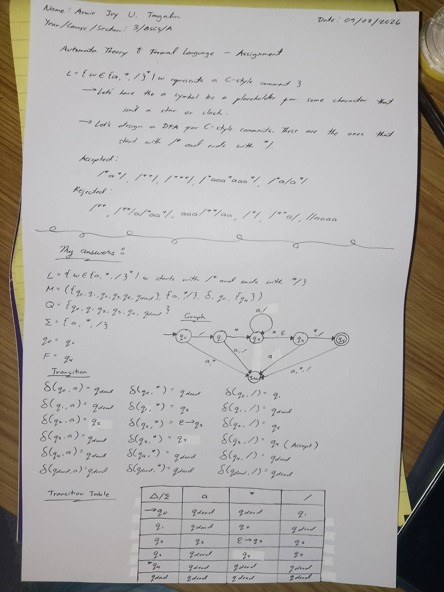
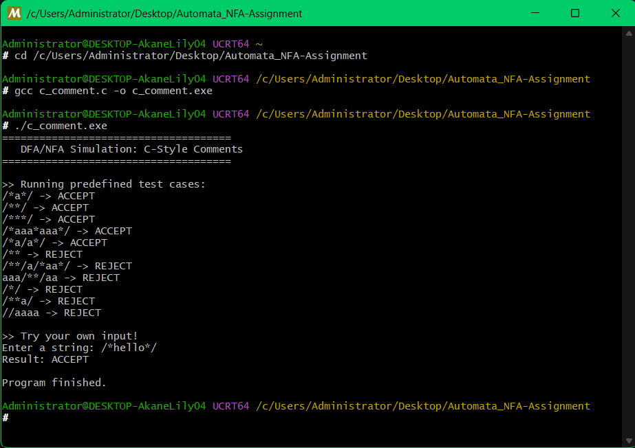

# Automata_NFA-Assignment

## Author
Armie Joy U. Tangalin

## Description
This project demonstrates an **NFA/DFA simulation** for recognizing **C-style comments** (`/* ... */`).  
It includes:
- Transition table representation
- DFA/NFA diagram
- C program implementation
- Sample test cases (Accepted/Rejected strings)

## Preview Assignment

## Output

